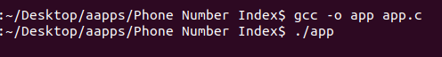

# SLT-Phone-Number-Location-Finder
Find the area location of the SLT phone number which you want

This document shows how to compile and run this C program on Ubuntu Linux using the **gcc compiler**. Please follow these simple steps.

## Run on Ubuntu OS

1. Open your clone folder. 
2. Right click & select **Open Terminal**. 
3. Now your terminal path is set to your app location.
4. Type this command to compile app.c. 
```
gcc -o app app.c
```
5. After that press enter key and type below command to run your C programme.
```
./app
```


## Online Compilation & Run Code
It's simple. Just open this **[link](https://www.onlinegdb.com/online_c_compiler)** and paste the whole code. Then you can compile and run this programme within 5 secends. 😉😍</br>


## App Summery
In this programme has very simple concepts to find the area location of SLT telephone numbers. User should input the first three digits of the phone number which is want to find the area location. Then press enter program displays the area of the phone number.


